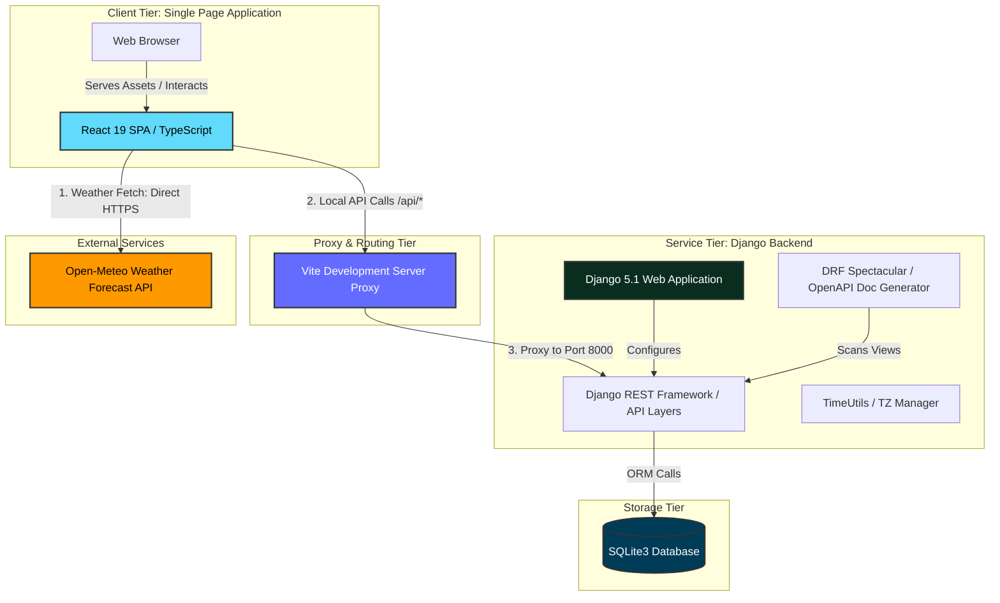
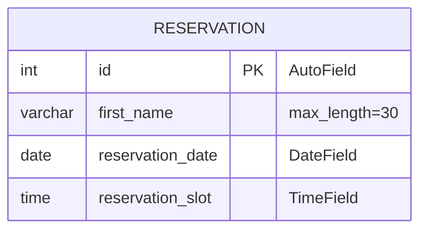
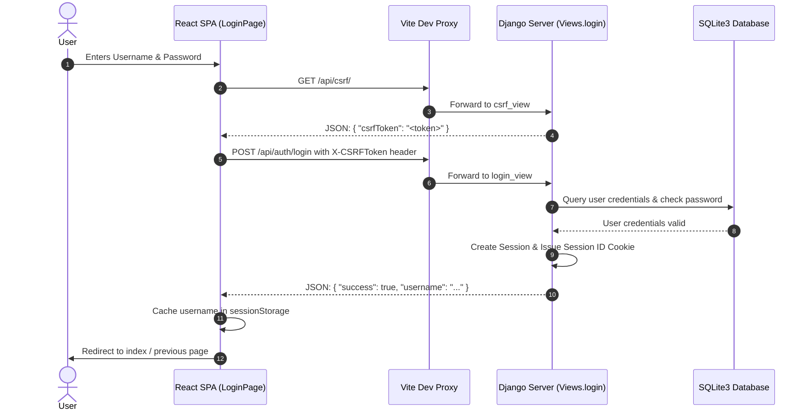
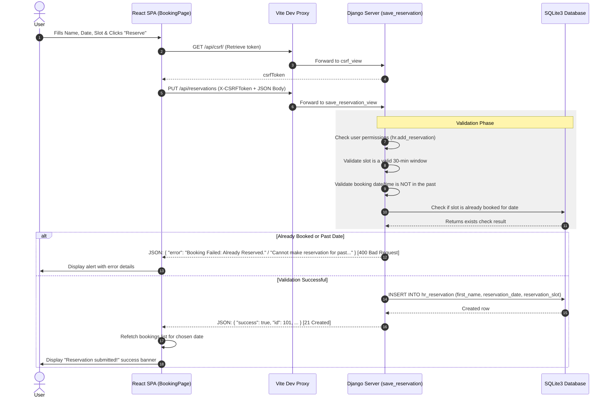

# Booking System Architecture Documentation

This document provides a comprehensive technical blueprint of the **Booking System** application. It details the system architecture, backend implementation, frontend design, request-response lifecycles, and deployment orchestration.

---

## 1. High-Level System Architecture

The Booking System is designed as a decoupled client-server architecture. It consists of a modern Single Page Application (SPA) frontend and a relational database-backed web API service, coordinated locally through a reverse proxy/dev-proxy configuration and deployed via Docker containers.

### Architectural Component Diagram



### ASCII High-Level Architecture representation

```text
+------------------------------------------------------------+
|                       WEB BROWSER                          |
|  +------------------------------------------------------+  |
|  |             React 19 (SPA) Frontend                  |  |
|  |  [BookingPage]  [ReservationsPage]  [EditPage]       |  |
|  +---------------------------+--------------------------+  |
+------------------------------|-----------------------------+
                               | (HTTP/JSON with CSRF & Cookies)
                               v
+------------------------------------------------------------+
|                  VITE DEVELOPMENT SERVER                   |
|  - Acts as a local reverse proxy for development          |
|  - Forwards /api/* and /admin/* requests to backend        |
+------------------------------|-----------------------------+
                               | (Proxied TCP to Port 8000)
                               v
+------------------------------------------------------------+
|                      DJANGO BACKEND                        |
|  +------------------------------------------------------+  |
|  |  Django REST Framework API Router (/api/)            |  |
|  +---------------------------+--------------------------+  |
|  |  Django Admin Interface (/admin)                     |  |
|  +---------------------------+--------------------------+  |
|  |  App "hr" - Reservation Models, Views, and Utils     |  |
|  +---------------------------+--------------------------+  |
+------------------------------|-----------------------------+
                               | (Django ORM Queries)
                               v
+------------------------------------------------------------+
|                     DATABASE LAYER                         |
|  - SQLite3 relational engine (db.sqlite3)                  |
|  - Manages hr_reservation table                            |
+------------------------------------------------------------+
```

---

## 2. Backend Technical Overview

The backend is built on **Django 5.1** and structured around a main app called `hr`. It serves as a secure RESTful API provider using the **Django REST Framework (DRF)**. API contract specifications and Interactive API documentation are automatically managed via **drf-spectacular**.

### 2.1 Database Models & Relations

The application employs a streamlined relational schema centered around a single core entity representing reservations.

#### Entity-Relationship Schema



- **Reservation Model (`backend/hr/models.py`)**:
  - `id`: Unique AutoField acting as the primary key.
  - `first_name`: A CharField limited to 30 characters representing the client's booking name.
  - `reservation_date`: A DateField representing the date of reservation.
  - `reservation_slot`: A TimeField representing the specific reservation hour (e.g., "14:30:00").

### 2.2 Timezone and Reservation Slot Business Logic

Reservations are governed by precise timezone and scheduling boundaries implemented in `backend/hr/time_utils.py` and validated inside views.

1. **Timezone Context**:
   - `settings.py` sets `TIME_ZONE = "Europe/Dublin"` and `USE_TZ = True`.
   - `TimeUtils.get_current_date_time()` generates an exact localized timestamp. It instantiates a UTC timestamp (`pytz.timezone('UTC')`) and shifts it explicitly to `Europe/London` (which aligns with Dublin's seasonal daylight savings changes) to perform chronological comparison.
2. **Reservation Slots Constraints**:
   - Eligible timeslots range from **09:00 AM to 07:00 PM** at **30-minute intervals** (i.e. `09:00 AM, 09:30 AM, ..., 06:30 PM, 07:00 PM`).
   - `TimeUtils.generate_time_slots` handles the logical matrix calculation to generate standard choice mappings.

### 2.3 Security, Sessions, and Session Synchronization

Security is enforced at multiple layers:

- **CSRF Protection**: All mutating operations (PUT, POST, DELETE) are safeguarded via Django's default `CsrfViewMiddleware`. The frontend issues an initial `GET /api/csrf/` request to capture the CSRF token from the secure cookie and then appends it as an `X-CSRFToken` request header in successive mutating API calls.
- **Granular API Permissions**: Rather than a blanket global authorization block, endpoint execution checks for specific Model Permissions assigned to the authenticated user using `Views._require_api_permission(request, codename)`.
  - To create a booking, users need `hr.add_reservation`.
  - To edit a booking, users need `hr.change_reservation`.
  - To delete a booking, users need `hr.delete_reservation`.
- **System Cleansings**: Only user accounts flagged with administrative access (`is_staff = True` or `is_superuser = True`) are permitted to bulk delete/clear upcoming reservations (`DELETE /api/bookings`).

---

## 3. API Endpoint Registry

All backend services are exposed via standardized JSON endpoints mapped in `backend/hr/urls.py` and documented in Swagger.

| HTTP Method | API Path | Auth Required? | Req. Permission | Payload Body (JSON) | Success Code | Description |
| :--- | :--- | :--- | :--- | :--- | :--- | :--- |
| **GET** | `/api/csrf/` | No | None | None | `200 OK` | Retrieves CSRF token to bind to security headers. |
| **GET** | `/api/auth/status` | No | None | None | `200 OK` | Returns session authentication status and username. |
| **POST** | `/api/auth/login` | No | None | `{ "username": "...", "password": "..." }` | `200 OK` | Evaluates credentials and sets Django session cookie. |
| **POST** | `/api/auth/logout` | No | None | None | `200 OK` | Destroys the active session cookie. |
| **GET** | `/api/version/` | No | None | None | `200 OK` | Returns current system semantic version string. |
| **GET** | `/api/user/` | No | None | None | `200 OK` | Returns the logged-in user name or `'unknown'`. |
| **GET** | `/api/bookings` | No | None | Query Params: `?date=YYYY-MM-DD` | `200 OK` | Returns list of bookings. If date is blank/omitted, yields future bookings from today. |
| **DELETE** | `/api/bookings` | Yes | Staff/Superuser | None | `200 OK` | Clears all reservations starting from today onward. |
| **GET** | `/api/bookingsById/<id>` | No | None | None | `200 OK` | Fetches details of a specific reservation. |
| **PUT** | `/api/bookingsById/<id>` | Yes | `hr.change_reservation` | `{ "first_name": "...", "reservation_date": "YYYY-MM-DD", "reservation_slot": "HH:MM AM/PM" }` | `200 OK` | Updates an existing booking. Rejects changes to past dates/times or duplicate slots. |
| **DELETE** | `/api/bookingsById/<id>` | Yes | `hr.delete_reservation` | None | `200 OK` | Deletes a reservation. |
| **PUT** | `/api/reservations` | Yes | `hr.add_reservation` | `{ "first_name": "...", "reservation_date": "YYYY-MM-DD", "reservation_slot": "HH:MM AM/PM" }` | `201 Created` | Creates a new reservation. Implements past dates/times and double-booking rejection. |

---

## 4. Frontend Technical Overview

The client-side application is a single-page architecture built with **React 19** and **TypeScript 5**, configured with **Vite 8** for lightning-fast bundling, HMR, and proxy routing during development.

### 4.1 Routing & Navigation State

Frontend URL routing is managed by `react-router-dom` (v7) inside `frontend/src/main.tsx`. Routes are defined as follows:

```text
              [Browser Router (App)]
                        │
         ┌──────────────┼──────────────┬──────────────┐
         ▼              ▼              ▼              ▼
     "/" (Public)   "/reservations"  "/login"      "*" (Fallback)
         │              │              │              │
     [BookingPage]  [Reservations] [LoginPage]    [ErrorPage]
                        │
                        ▼ (Auth Protected Check)
                "/reservations/edit/:id"
                        │
            [RequireAuth Guard HOC]
                        │
                        ▼ (Authorized)
              [EditReservationPage]
```

- **`RequireAuth` Guard Component**: Intercepts requests to `/reservations/edit/:id`. It fires a background verification check using `getAuthStatus()`. If the user is unauthenticated, it redirects them to `/login` while passing the current path inside React Router's location state (`state: { from: location }`) to support automatic return redirection upon successful login.

### 4.2 Local Cache Strategies

To minimize redundant server roundtrips and improve user experience, the frontend implements two caching utilities:

1. **Application Version Cache (`appVersionCache.tsx`)**:
   - Caches the application version returned by `/api/version/` in the browser's `localStorage`.
   - Uses a **Cache Time-To-Live (TTL) of 1 hour** (3,600,000 ms). If the cache expires, it pulls a fresh value from the server.
2. **Current User Cache (`currentUserCache.tsx`)**:
   - Caches the authenticated user's name returned by `/api/user/` in `sessionStorage`.
   - Prevents refetching username strings during component re-renders of the `Navbar` across pages, clearing immediately when the session is closed or when a user logs out.

### 4.3 Third-Party Weather API Integration

To help users select the best reservation times, the `BookingPage` displays a real-time **Dublin Weather Snapshot** by connecting to the public **Open-Meteo API**:
- **Endpoint**: `https://api.open-meteo.com/v1/forecast?latitude=53.3498&longitude=-6.2603&current=temperature_2m,wind_speed_10m,weather_code&timezone=auto`
- **Aesthetic Presentation**: A responsive, linear gradient banner displays temperatures, wind speeds, and mapped description statuses (e.g. "Clear sky", "Partly cloudy", "Rain showers").
- **Network Safety**: Employs an `AbortController` signal bound to the React `useEffect` hook. This cancels the background fetch if the user navigates away before the network request resolves, preventing memory leaks and state updates on unmounted components.

---

## 5. End-to-End System Data Flows

### 5.1 Authentication and Session Setup Flow

This sequence demonstrates how a user establishes an authenticated session to manage bookings.



### 5.2 Creating a Booking Flow

This sequence demonstrates creating a reservation, detailing the validations performed.



---

## 6. Deployment & Development Architecture

The development and containerization workflow uses a unified, deterministic environment.

### 6.1 Multi-Process Container Setup

Local deployments are fully containerized using **Docker** and **Docker Compose**.

- **`Dockerfile` (Single-Stage Custom Build)**:
  - Uses `python:3.14-slim` as the base image.
  - Installs binary dependencies like `default-libmysqlclient-dev` (for potential production MySQL adapters), system compilers, and **Node.js 24**.
  - Installs Python dependencies from `backend/requirements.txt` and Node dependencies from `frontend/package.json` under `/backend` and `/frontend` respectively.
  - Copies all source trees and invokes Django's static compiler `python manage.py collectstatic --noinput` to prepare Django Admin stylesheets.
- **Entrypoint Management (`entrypoint.sh`)**:
  - The container orchestrates two simultaneous servers using process backgrounding:
    1. Starts Django server: `python manage.py runserver 0.0.0.0:8000 &` (Backgrounded).
    2. Delays for 5 seconds to ensure port availability and DB stability.
    3. Starts Vite dev server: `npm run dev -- --host` (Foreground).
  - Port `8000` (Django REST API) and Port `5173` (Vite) are both exposed through Docker Compose to host interfaces.

### 6.2 Testing Framework

The application ensures stability through parallel testing pipelines:

1. **Backend Testing Pipeline**:
   - Utilizes `pytest` (configured in `backend/pytest.ini`).
   - `backend/hr/test_apis.py` runs REST integration tests verifying CRUD endpoints, permissions, validations, and CSRF barriers.
   - `backend/hr/test_forms.py` validates Django form layout checks and default values.
2. **Frontend Testing Pipeline**:
   - Built on `jest` with `jsdom` configuration (`frontend/jest.config.js`).
   - Employs `@testing-library/react` and `@testing-library/jest-dom` for component testing.
   - Core pages and components (e.g. `BookingPage.test.tsx`, `Navbar.test.tsx`, caching modules) are fully covered using mock mockups for fetch endpoints and local storage operations.
