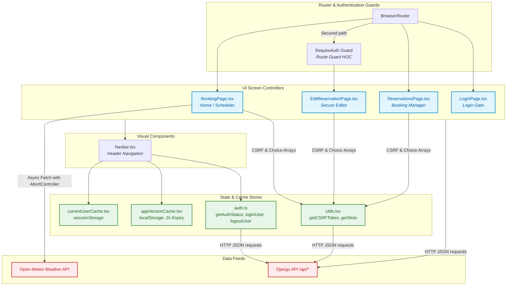

# Booking System Frontend (SPA)

[](https://github.com/conorheffron/booking-sys/actions/workflows/main_booking-sys.yml)
[](https://github.com/conorheffron/booking-sys/actions/workflows/node.js.yml)
[](https://github.com/conorheffron/booking-sys/actions/workflows/npm-publish-packages.yml)
[](https://www.npmjs.com/package/@conorheffron/booking-sys-frontend)
[](https://www.gnu.org/licenses/gpl-3.0)

This is the decoupled, modern **React 19 + TypeScript 5 + Vite 8** Single Page Application (SPA) frontend for the Booking System. This client-side package was successfully migrated from legacy server-side templates to a highly interactive, responsive user experience utilizing **Bootstrap 5.3**.

- **NPM Package**: [@conorheffron/booking-sys-frontend](https://www.npmjs.com/package/@conorheffron/booking-sys-frontend)
- **GitHub Repository**: [conorheffron/booking-sys (Frontend Workspace)](https://github.com/conorheffron/booking-sys/tree/main/frontend)
- **GitHub Package**: [booking-sys-frontend (GitHub Container Registry)](https://github.com/conorheffron/booking-sys/pkgs/npm/booking-sys-frontend)

---

## 🏛️ Frontend System Architecture

The frontend is fully modularized. It interfaces with the backend web services through session-based REST APIs, enforcing client-side route protection and maintaining persistent user/version caches.

### Client-Side Component Structure & Data Flows



---

## 🛠️ Features

1. **Reactive Booking Interface (`BookingPage`)**:
   - Selecting a date automatically initiates queries to view scheduled slots.
   - Selects from dynamically compiled 30-minute intervals between **09:00 AM and 07:00 PM**.
2. **Third-Party Weather Snippet**:
   - Live Dublin weather (temperature, wind speeds, descriptions) fetched from **Open-Meteo API**.
   - Employs React hook `AbortController` cancellation to eliminate memory leaks upon component unmounting.
3. **Session-Level Local Caching**:
   - **Current User Cache**: Stores active credentials in `sessionStorage` to prevent repeating user API reads.
   - **System Version Cache**: Stores application semantic release strings inside `localStorage` with a **1-hour TTL (Time-To-Live)** expiry configuration.
4. **Security Enforcement**:
   - Transparent CSRF pipeline fetching and loading validation cookies on demand.
   - Dynamic `RequireAuth` context checking to shield sensitive pages.

---

## 📋 Prerequisites

- **Node.js**: `v24` (LTS) or later is recommended.
- **npm**: `v11` or higher.

---

## 🚀 Installation & Setup

1. **Navigate to the frontend folder**:
    ```bash
    cd frontend
    ```

2. **Install all packages**:
    ```bash
    npm install
    ```

3. **Launch the Hot-Reloading Development Server**:
    ```bash
    npm run dev
    ```
    This launches the SPA locally at [http://localhost:5173](http://localhost:5173). 

4. **API Proxy Configuration**:
   During development, the SPA proxies modifying requests to the local backend dynamically. This is configured in `vite.config.ts`:
   ```typescript
   proxy: {
     '/api': 'http://0.0.0.0:8000',
     '/admin': 'http://0.0.0.0:8000',
     '/static/admin': 'http://0.0.0.0:8000',
   }
   ```

---

## 📦 Production Bundling

To compile and optimize the client application assets for production deployments:

```bash
npm run build
```
The compressed, code-split bundles are output directly into the `dist/` workspace folder.

### Previewing the Production Build Locally
To run a local web server displaying the pre-built static application assets:
```bash
npm run preview
```

---

## 🧪 Frontend Test Suites

The test suite is built on **Jest** combined with **JSDOM** (`@testing-library/react`) to simulate a high-fidelity web browser environment.

### 1. Execute All Tests
```bash
npm run test
```
*Expected Output Structure:*
```text
 PASS  test.tsx
 PASS  src/components/__tests__/Utils.test.tsx
 PASS  src/components/__tests__/appVersionCache.test.tsx
 PASS  src/components/__tests__/Navbar.test.tsx

Test Suites: 4 passed, 4 total
Tests:       12 passed, 12 total
Snapshots:   0 total
Time:        3.12 s
Ran all test suites.
```

### 2. Execute a Specific Test Suite (e.g., Utils)
```bash
npm run test -- src/components/__tests__/Utils.test.tsx
```

### 3. Target Specific Tests by Title / Regular Expression
```bash
npm run test -- -t="should fetch CSRF token from /api/csrf/"
```

### 4. Run Tests and Generate Coverage Metrics
```bash
npm run test -- --coverage
```
This generates a detailed code-coverage chart under the local `coverage/` folder.
